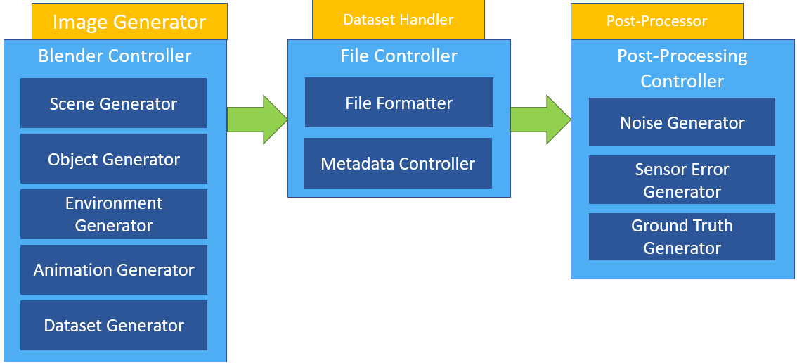

<!--
 Copyright (c) 2023 Tartu University, Ric Dengel

 This program is free software: you can redistribute it and/or modify
 it under the terms of the GNU General Public License as published by
 the Free Software Foundation, either version 3 of the License, or
 (at your option) any later version.

 This program is distributed in the hope that it will be useful,
 but WITHOUT ANY WARRANTY; without even the implied warranty of
 MERCHANTABILITY or FITNESS FOR A PARTICULAR PURPOSE. See the
 GNU General Public License for more details.

 You should have received a copy of the GNU General Public License
 along with this program. If not, see <https://www.gnu.org/licenses/>.
 -->


# FlyByGen
FlyByGen is a fully modular tool which allows the creation of various in space Fly-By scenarios and according image data.
The pipeline consists of three parts
1. Image Generator
2. Dataset Handler
3. Post-Processor


The default image generator utilises blender as graphics generator and the post-processor utilises python libraries as default
Multiple modules are found in src/blender/ and src/postProcessing
Each of the modules contributes almost independently to the final result and can be exchanged as wanted following some simple guidelines.

## Table of Contents (Optional)
- [SetUp](#setup)
- [Usage](#usage)
- [Documentation](#documentation)
- [Credits](#credits)
- [License](#license)
- [Planned features](#planned-features)
- [Tests](#tests)

## Setup
### Python
Blender comes with a python installation.
Ideally this is used directly, so no further python installations are required.
If Blender is not being used, then a separate python installation is required and anaconda environments are recommended. 
In any scenario the following libraries have to be installed to the according Python environment:
- numpy: pip install numpy

### Blender
Blender version used for development is 3.4. Install it in the default directory and set the path correctly in src/config/paths.json.
Use of other blender versions should not cause any issues, but no tests have been performed. Please report if you managed to run other versions as well to state support here. 

### Docs with sphinx
The documentation requirements should be automatically installed with the make.bat / makefile execution.
However to update the documentation of this project, there may be some additional software requirements as listed:
- sphinx: pip install sphinx
- sphinx_design: pip install sphinx_design
- furo for html: pip install furo
- myst-parser for md use: pip install myst-parser


## Usage
Run 
```
python .\FlyByGen.py
```
To run only the graphic generation of post processing adapt ```.\FlyByGen.py``` accordingly.

Integration of own modules is done to ```blenderModules.json``` or ```postModules.json``` accordingly. 
Additionally the pipeline allows to be stopped in any part.
For example the pipeline can be run only with the first modules in the according .json files. 
Then for example the .blend files of blender can be adapted and subsequently the pipeline can be continued by integrating the left modules.

## Documentation

### Where?
The documentation for this project is create with sphinx and can be found via
<!-- TODO: Add reference to extensive documentation -->

### How
Adapt make.bat for windows systems or makefile for linux based systems to use the right sphinx build options when blender is part of the toolchain or not.
If blender is used in the toolchain, adapt the path in line 8 of the makefile and make.bat to suit your blender path. 

## Credits
This tool was written by Ric Dengel with support of Mihkel Pajusalu within the scope of the PhD work and co-sponsored through an [activity](https://activities.esa.int/4000141651) within the European Space Agency OSIP program. 
The work is also described in TBD (TODO: add article link)

This work also would not have been possible without the Blender open source community.

## License:
The GNU General Public License version 3-0 (GPLv3) applies to this project as in https://www.gnu.org/licenses/gpl-3.0.en.html. 

## Planned Features

1. Import option to load extra materials and other files into the blender base file.
2. Extension of animation capabilities
3. Extension of dust system to full particle system to enable a coma tail
4. Integration of useful tool such as [Orekit](https://www.orekit.org/), [DAMIT](https://astro.troja.mff.cuni.cz/projects/damit/), 


## Tests
TBD