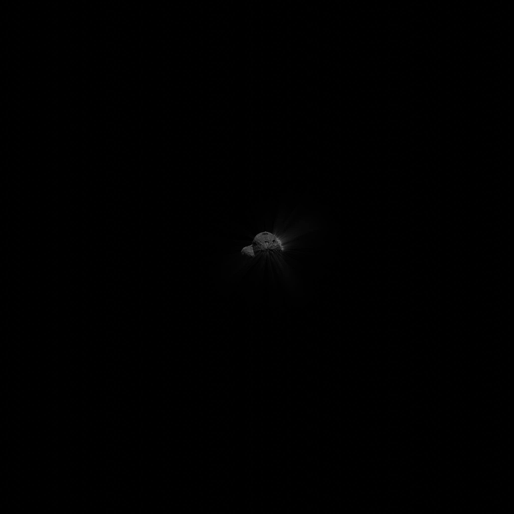

Introduction
============

This documentation explains the goals and scope as well as the functionalitities
and known issues of this documentation.
Currently this documentation is not completed and is just in its setup and development stage. 

.. _about:

About FlyByGen
--------------

.. _exampleCometRender:

   Automatically generated comet example image with dust jets.

As you can see in the :ref:`exampleCometRender` image the pipeline is able to generate automatically
any kind of image from a fly-by scenario. 
It was primarly developed for the Comet Interceptor mission with the goal in mind to generate in future
images of comet fly-bys for other mission scenarios.

Issues
------
Json files cannot be updated during runtime before they have been loaded. They are loaded during the process and thus changing them during runtime (before the render starts) can lead to unwanted results
